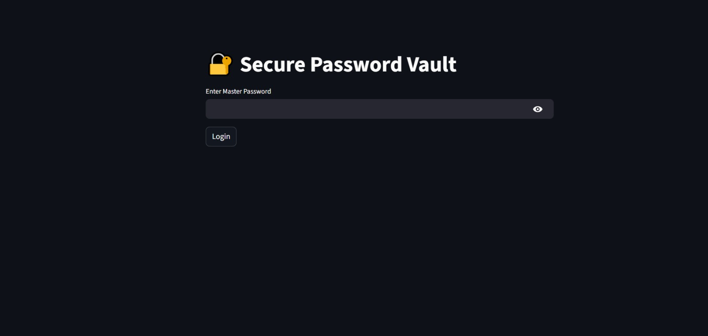
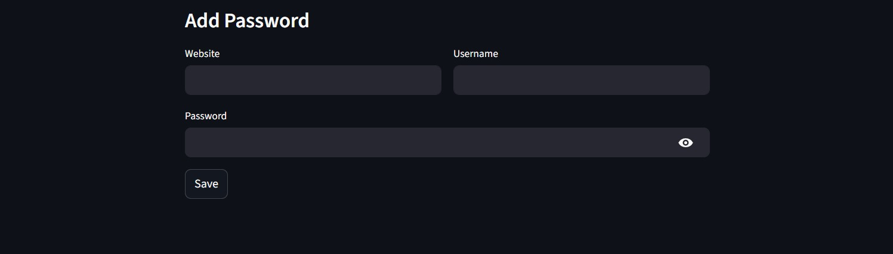
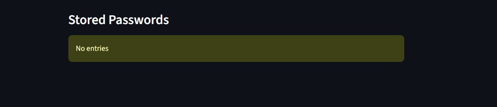
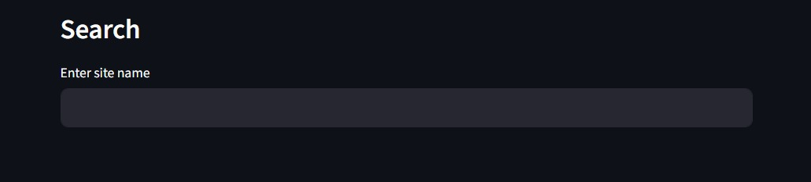
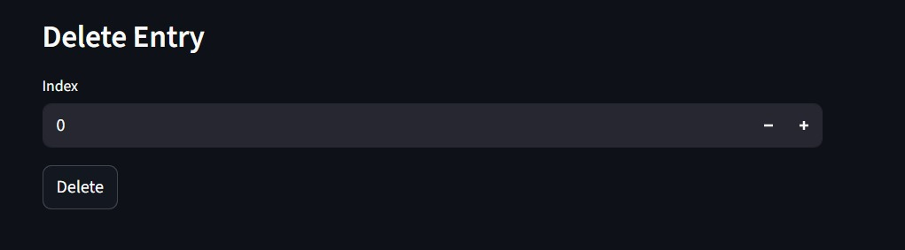

```
███████╗███████╗ ██████╗██╗   ██╗██████╗ ███████╗    ██╗   ██╗ █████╗ ██╗   ██╗██╗  ████████╗
██╔════╝██╔════╝██╔════╝██║   ██║██╔══██╗██╔════╝    ██║   ██║██╔══██╗██║   ██║██║  ╚══██╔══╝
███████╗█████╗  ██║     ██║   ██║██████╔╝█████╗      ██║   ██║███████║██║   ██║██║     ██║   
╚════██║██╔══╝  ██║     ██║   ██║██╔══██╗██╔══╝      ╚██╗ ██╔╝██╔══██║██║   ██║██║     ██║   
███████║███████╗╚██████╗╚██████╔╝██║  ██║███████╗     ╚████╔╝ ██║  ██║╚██████╔╝███████╗██║   
╚══════╝╚══════╝ ╚═════╝ ╚═════╝ ╚═╝  ╚═╝╚══════╝      ╚═══╝  ╚═╝  ╚═╝ ╚═════╝ ╚══════╝╚═╝   
```

<div align="center">


**A fully local, AES-256 encrypted password manager. No cloud. No subscriptions. No trust required.**

</div>

<hr>

## Overview

Secure Vault is a lightweight, offline password manager built with Python and Streamlit. Every credential is encrypted using AES-256 CBC before being written to disk — your master password is never stored, only a PBKDF2-derived key hash is used for verification.

Your data never leaves your machine.

<hr>

## Screenshots

<table>
  <tr>
    <td align="center"><b>Master Password Setup</b></td>
    <td align="center"><b>Add Password</b></td>
  </tr>
  <tr>
    <td></td>
    <td></td>
  </tr>
  <tr>
    <td align="center"><b>View Passwords</b></td>
    <td align="center"><b>Search</b></td>
  </tr>
  <tr>
    <td></td>
    <td></td>
  </tr>
  <tr>
    <td align="center"><b>Delete Entry</b></td>
    <td></td>
  </tr>
  <tr>
    <td></td>
    <td></td>
  </tr>
</table>

<hr>

## Security Architecture

| Layer | Implementation |
|---|---|
| Encryption Algorithm | AES-256 CBC |
| Key Derivation | PBKDF2-SHA256 — 100,000 iterations |
| Initialization Vector | Random 16-byte IV generated per entry |
| Salt | Random 16-byte salt generated on setup |
| Master Password | Never stored — only the derived key hash |
| Storage | Local encrypted JSON file |

> The database file `secure_db.json` is excluded from version control via `.gitignore`. Never commit it.

<hr>

## Features

- Master password authentication with PBKDF2 key derivation
- AES-256 CBC encryption for every stored credential
- Live password strength analysis on input
- Show / hide toggle for stored passwords
- One-click copy to clipboard
- Site name search
- Entry deletion by index

<hr>

## Getting Started

### Prerequisites

- Python 3.7 or higher

### Installation

**1. Clone the repository**
```bash
git clone https://github.com/cipher-saif/secure-password-manager.git
cd secure-password-vault
```

**2. Install dependencies**
```bash
pip install -r requirements.txt
```

**3. Launch the app**
```bash
streamlit run secure_vault.py
```

**4. First launch**

You will be prompted to create a master password (minimum 8 characters). This is the only password you will ever need to remember.

<hr>

## Project Structure

```
secure-password-vault/
│
├── secure_vault.py         # Core application
├── secure_db.json          # Encrypted local database (auto-generated, git-ignored)
├── requirements.txt        # Python dependencies
├── .gitignore
├── LICENSE
├── README.md
│
└── screenshots/
    ├── master_pwd.png
    ├── add.png
    ├── view.png
    ├── search.png
    └── delete.png
```

<hr>

## Dependencies

| Package | Purpose |
|---|---|
| `streamlit` | Web UI framework |
| `pycryptodome` | AES encryption and PBKDF2 key derivation |
| `pyperclip` | System clipboard access |

Install all at once:
```bash
pip install -r requirements.txt
```

<hr>

## Notes

- `pyperclip` requires a desktop environment. The copy feature works locally but will not function on cloud-hosted Streamlit deployments.
- The `secure_db.json` file holds all your encrypted data. Back it up if needed — losing it means losing your vault.

<hr>

## License

Distributed under the MIT License. See `LICENSE` for details.

<hr>

<div align="center">
Built with Python — designed for privacy.
</div>
